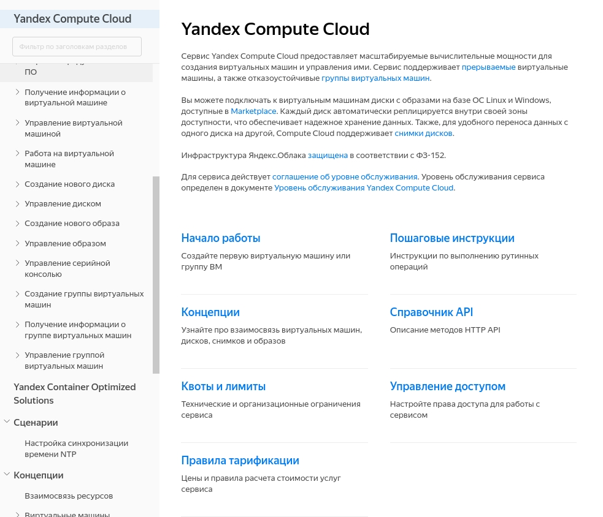

**русский** | [english](https://github.com/yandex-cloud/yfm-docs/blob/master/DOCS.md)
- - -

# Структура YFM проекта

## Содержание

- [Пример структуры проекта](#example)
- [Оглавление документа](#toc)
    - [Вставки оглавлений](#tocIncludes)
- [Разводящая страница](#page)
- [Объявление переменных](#presets)
    - [Условия видимости разделов](#conditionalOperatorWhen)
- [Файл конфигурации](#config)

## Пример структуры проекта <a name="example"></a>

В качестве максимально полного примера YFM проекта можно смотреть исходники [документации Яндекс.Облака](https://github.com/yandex-cloud/docs).

```
input-folder
|-- .yfm (Файл конфигурации YFM)
|-- toc.yaml (Файл навигации)
|-- presets.yaml (Набор пресетов с переменными)
|-- index.yaml (Разводящая страница документации)
|-- quickstart.md (Файлы документации и изображения)
|-- pages
    |-- faq.md
    |-- how-to.md
|-- assets
    |-- image1.png
    |-- image2.png
|-- includes
    |-- faq_shared_block.md
```

## Оглавление документа <a name="toc"></a>

Структура документа описывается в файле `toc.yaml`:

* Только файлы, указанные в toc.yaml, обрабатываются при сборке документации.
* Содержание документа генерируется на основе toc.yaml.

Файл `toc.yaml` имеет следующую структуру:

```yaml
- title: Имя документа
  href: index.yaml
- name: Имя раздела
  href: path/to/file.md
  items:
    - name: Имя группы разделов
      items:
        - name: Имя раздела
          href: path/to/file.md
        - name: Имя вложенного блока
          items:
            - name: Имя раздела во вложенном блоке
              href: path/to/some/file.md
    - name: Имя другого раздела
      href: path/to/another/file.md
    - name: Раздел с условным вхождением
      href: path/to/conditional/file.md
      when: version == 12
    - name: Имя заимствованного блока
      include:
        path: another/toc.yaml
```

* `title` — название документа. Название отображается в содержании документа над списком всех разделов.
* `name` — имя блока или раздела.
* `href` — относительный путь до файла с YFM-контентом.
* `items` — группирующий элемент для отдельных разделов. Сгруппированные разделы отображаются в одном блоке в содержании документа.
* `when` — [условный оператор](#conditionalOperatorWhen). Позволяет включать и исключать в документ отдельные разделы или блоки в зависимости от значений переменных.
* `include` — элемент, который позволяет [вставить другое оглавление](#tocIncludes) (другой файл `toc.yaml`) как подраздел. Должен содержать дочениний элемент `path`.
* `path` — путь до оглавления, которое нужно вставить.

### Вставки оглавлений <a name="tocIncludes"></a>

Вы можете включить в свой документ оглавление другого документа (другой файл `toc.yaml`) как подраздел. Так вы сможете независимо поддерживать отдельные разделы и потом собирать документ из крупных блоков. Это может быть полезно, например, если вы поддерживаете две версии документа: упрощенную справку для пользователей и более полное руководство администратора.

## Разводящая страница <a name="page"></a>

Для быстрой навигации по разделу, часто удобно сделать первый экран в разделе не обзорным текстом, а набором ссылок на основные разделы. Yfm-docs позволяет сделать их не просто ссылками, а удобными для клика плитками.



Файл `index.yaml` имеет следующую структуру:

```yaml
# Заголовок и описание
title: "Биллинг в облаке"
description: "Биллинг — это сервис в составе Яндекс.Облака, который позволяет получать информацию о количестве потребленных ресурсов, проверять расходы денежных средств и оплачивать ресурсы. В Яндекс.Облаке вы платите только за потребленные ресурсы и только за время их фактического использования."
# Мета-информация title, description, keywords и т.п. (title вкладки и разные SEO-теги)
meta:
  title: "Биллинг в облаке"
  noIndex: true
# Блок с ссылками
links:
- title: "Начало работы"
  description: "Как создать свою первую виртуальную машину"
  href: "#"
  when: version == 12
- title: "Базовые операции"
  description: "Пошаговые инструкции по операциям настройки, подключения, изменения"
  href: "#"
```
* `title`: Название документа. Название отображается в содержании документа над списком всех разделов.
* `description`: Описание документа.
* `meta`: Мета-информация title, description, keywords и т.п.
* `links`: Группирующий элемент для отдельных разделов. Сгруппированные разделы отображаются как ссылки на странице.
  * `title`: Имя ссылки.
  * `description`: Описание страницы.
  * `href`: Относительный путь до файла с YFM-контентом.
  * `when`: [условный оператор](#conditionalOperatorWhen). Позволяет включать и исключать в документ отдельные разделы или блоки в зависимости от значений переменных.

## Объявление переменных <a name="presets"></a>

В YFM вы можете объявлять и использовать [переменные](https://github.com/yandex-cloud/yfm-transform/blob/master/DOCS.ru.md#vars). При сборке переменные будут подставлены в текст документации или использованы для вычисления условий. Это удобно, например, для сборки документации разных версий сервиса из одних и тех же исходных файлов.

Набор значений переменных объявляется в файлах пресетов: `presets.yaml`:

```yaml
default:
    position: Волшебник
internal:
    place: Изумрудный город
external:
    place: Страна Оз
```
* Каждый файл пресетов должен содержать секцию `default`.
* При вычислении переменных берутся значения из секции `default` и из секции указанной в параметре `varsPreset`, с приоритетом последней.

Пресеты удобны, например, если вы собираете документацию в двух режимах: внутренней и внешней. Создайте пресет с секциями `internal` и `external` и вам не понадобится хранить значения переменных в скриптах сборки.

Файлов пресетов может быть несколько. Они будут накладываться в порядке уменьшения приоритета: от ближайшего к конвертируемому сейчас файлу до самого близкого к корню проекта. Но мы рекомендуем ограничится максимально верхнеуровневыми пресетами.

**Пример**

```
input-folder
|-- .yfm
|-- toc.yaml
|-- presets.yaml // 2
|-- index.yaml
|-- quickstart.md
|-- pages
    |-- presets.yaml // 1
    |-- faq.md
    |-- how-to.md
```

* При сборке файла `faq.md` значения переменных, объявленные в файле `presets.yaml` номер 1, будут иметь приоритет над файлом номер 2.
* При сборке файла `quickstart.md` будут учитываться только значения переменных, объявленные в файле `presets.yaml` номер 2.

### Условия видимости разделов <a name="conditionalOperatorWhen"></a>

Вы можете включать в документ отдельные разделы или блоки в зависимости от значений [YFM переменных](https://github.com/yandex-cloud/yfm-transform/blob/master/DOCS.ru.md#vars). Это удобно, например, для сборки документации разных версий сервиса из одних и тех же исходных файлов.

Условие видимости описывается в параметре `when`:

```when: version == 12```

Доступны операторы сравнения: ==, !=, <, >, <=, >=.


## Файл конфигурации <a name="config"></a>

Проект может содержать файл настроек. По умолчанию, используется файл `.yfm` в корне проекта.

Имя | Описание | Тип | Значение по-умолчанию
:--- | :--- | :--- | :---
allowHTML | Разрешено ли использование HTML | bool | false
varsPreset | Имя используемого пресета | string | 'default'
strict | Допустимы ли предупреждения в логах yfm-transform | bool | false
ignore | Список файлов исключаемые из сборки | [] | undefined
vars | Переменные | {} | undefined
publish | Опубликовать сгенерированные файлы в S3 | bool | false
storageEndpoint | Адрес S3-совместимого хранилища | string | undefined
storageBucket | Имя бакета в S3-совместимом хранилище | string | undefined
storagePrefix | Префикс корневой директории в S3-совместимом хранилище | string | ""
storageKeyId | Идентификатор ключа доступа в S3-совместимом хранилище. Секрет ключа доступа должен быть объявлен в переменной окружения `YFM_STORAGE_SECRET_KEY`. | string | undefined

```yaml
allowHTML: true
strict: true
varsPreset: "default"
ignore:
    "**/includes/*.md"
```
