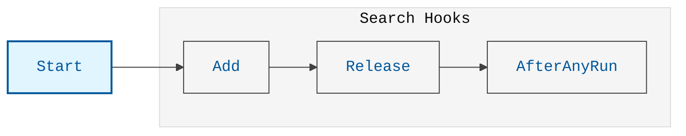

# Разработка плагинов для Diplodoc

## Жизненный цикл сборки

```mermaid
%%{init: {'theme': 'base', 'themeVariables': { 'fontFamily': 'monospace', 'primaryColor': '#e1f5fe', 'primaryBorderColor': '#01579b', 'primaryTextColor': '#01579b', 'lineColor': '#424242', 'secondaryColor': '#f5f5f5', 'tertiaryColor': '#f5f5f5'}}}%%
graph LR
    %% Основные этапы
    Start[Start] --> Init[Init]
    Init --> BeforeAnyRun
    BeforeAnyRun --> BeforeRun
    BeforeRun --> Prepare[Prepare]
    
    %% Подготовка
    Prepare --> PrepareInput[PrepareInput]
    Prepare --> PrepareEnv[PrepareEnv]
    Prepare --> LoadTOC[LoadTOC]
    
    %% Обработка
    LoadTOC --> Process[Process]
    Process --> Entry
    Process --> Search[Search]
    Entry --> Search
    
    %% Завершение
    Search --> Release[Release]
    Release --> AfterRun
    AfterRun --> AfterAnyRun
    AfterAnyRun --> End[End]

    %% Группировка этапов
    subgraph "Initialization"
        BeforeAnyRun
        BeforeRun
    end

    subgraph "Preparation"
        PrepareInput
        PrepareEnv
        LoadTOC
    end

    subgraph "Processing"
        Process
        Entry
        Search
    end

    subgraph "Completion"
        Release
        AfterRun
        AfterAnyRun
    end

    %% Стили
    classDef startNode fill:#e1f5fe,stroke:#01579b,stroke-width:2px
    classDef endNode fill:#e1f5fe,stroke:#01579b,stroke-width:2px
    classDef hookNode fill:#f5f5f5,stroke:#424242,stroke-width:1px
    classDef processNode fill:#f5f5f5,stroke:#424242,stroke-width:1px

    %% Применение стилей
    class Start,End startNode
    class BeforeAnyRun,BeforeRun,Entry,AfterRun,AfterAnyRun hookNode
    class PrepareInput,PrepareEnv,LoadTOC,Process,Search,Release processNode
```



## Хуки сборки

### Основные хуки

1. **BeforeAnyRun**
   - Выполняется перед любым запуском сборки
   - Идеальное место для инициализации глобальных ресурсов
   - Доступен для всех типов сборки (MD/HTML)

2. **BeforeRun**
   - Выполняется перед началом конкретного типа сборки
   - Доступен для конкретного формата вывода (MD/HTML)
   - Используется для настройки специфичных для формата параметров

3. **Entry**
   - Выполняется для каждой записи в TOC после её обработки
   - Предоставляет доступ к обработанной информации о записи
   - Полезен для модификации или анализа контента

4. **AfterRun**
   - Выполняется после завершения сборки конкретного типа
   - Используется для финализации и очистки ресурсов
   - Доступен для конкретного формата вывода

5. **AfterAnyRun**
   - Выполняется после завершения всей сборки
   - Идеальное место для финализации глобальных ресурсов
   - Доступен для всех типов сборки

### Пример использования хуков

```typescript
import {getHooks} from '~/commands/build';

export class MyPlugin {
    apply(program: Build) {
        // Подписка на глобальный хук
        getBaseHooks(program).BeforeAnyRun.tap('MyPlugin', async (run) => {
            // Инициализация ресурсов
        });

        // Подписка на хук для конкретного формата
        getBuildHooks(program)
            .BeforeRun.for('html')
            .tap('MyPlugin', (run) => {
                // Настройка для HTML формата
            });

        // Подписка на обработку записей
        getBuildHooks(program)
            .Entry.for('html')
            .tap('MyPlugin', (entry, info, tocDir) => {
                // Обработка информации о записи
            });
    }
}
```

## Модули сборки

### Основные модули

1. **Шаблонизация (Templating)**
   - Обработка шаблонов и переменных
   - Поддержка Liquid и других шаблонизаторов

2. **Пользовательские ресурсы (CustomResources)**
   - Управление пользовательскими скриптами и стилями
   - Копирование ресурсов в выходную директорию

3. **Участники (Contributors)**
   - Управление информацией об авторах
   - Интеграция с VCS для получения метаданных

4. **Одна страница (SinglePage)**
   - Генерация одностраничной версии документации
   - Управление навигацией в одностраничном режиме

5. **Редиректы (Redirects)**
   - Управление перенаправлениями
   - Генерация правил редиректов

6. **Линтер (Lint)**
   - Проверка качества документации
   - Валидация ссылок и контента

7. **Чейнджлоги (Changelogs)**
   - Управление историей изменений
   - Генерация логов изменений

8. **Поиск (Search)**
   - Индексация контента
   - Поддержка различных провайдеров поиска

9. **Вывод MD (OutputMd)**
   - Генерация Markdown файлов
   - Обработка зависимостей

10. **Вывод HTML (OutputHtml)**
    - Генерация HTML файлов
    - Управление ассетами

11. **Легаси (Legacy)**
    - Поддержка устаревших функций
    - Обратная совместимость

## Разработка расширений для Diplodoc

### Структура расширения

```javascript
const {getHooks: getBaseHooks} = require('@diplodoc/cli/lib/program');
const {getHooks: getBuildHooks} = require('@diplodoc/cli/lib/commands/build');
const {option} = require('@diplodoc/cli/lib/config');

const EXTENSION = 'MyExtension';

module.exports.Extension = class Extension {
    apply(program) {
        // Регистрация опций
        program.addOption(
            option({
                flags: '--my-option <value>',
                desc: 'Описание опции',
                env: 'MY_OPTION',
                default: 'значение по умолчанию',
                required: true,
            })
        );

        // Регистрация хуков
        getBuildHooks(program)
            .BeforeRun.for('html')
            .tap(EXTENSION, (run) => {
                // Логика расширения
            });
    }
}
```

### Пути к расширениям

Расширения могут быть загружены двумя способами:

1. **Через аргументы командной строки**:
   ```bash
   docs build --extensions ./path/to/extension.js
   ```
   Пути в аргументах должны быть относительными к текущей рабочей директории (PWD).

2. **Через конфигурацию**:
   ```yaml
   extensions:
     - ./path/to/extension.js
     # или с опциями
     - path: ./path/to/extension.js
       options:
         key: value
   ```
   Пути в конфигурации должны быть относительными к файлу конфигурации.

### Рекомендации по разработке

1. **Структура**
   - Экспортируйте класс через `module.exports.Extension`
   - Используйте `option` для определения опций
   - Регистрируйте хуки в методе `apply`

2. **Пути**
   - Используйте относительные пути в конфигурации
   - Учитывайте контекст загрузки (PWD или конфигурация)
   - Проверяйте существование файлов расширений

3. **Опции**
   - Используйте `option` для определения опций
   - Поддерживайте переменные окружения через `env`
   - Документируйте опции в описании

4. **Производительность**
   - Используйте асинхронные операции
   - Кэшируйте результаты тяжелых операций
   - Оптимизируйте обработку больших объемов данных
   - Используйте пулы для параллельной обработки

5. **Логирование**
   - Используйте `run.logger` для логирования
   - Разделяйте логи по уровням (info, warn, error)
   - Предоставляйте контекст в сообщениях об ошибках
   - Логируйте важные этапы выполнения

6. **Тестирование**
   - Тестируйте загрузку расширений
   - Проверяйте работу с относительными путями
   - Тестируйте обработку опций
   - Проверяйте производительность на больших наборах данных

### Пример расширения

```javascript
const {createReadStream} = require('node:fs');
const {dirname, join} = require('node:path');
const {extract} = require('tar-fs');

const {getHooks: getBaseHooks} = require('@diplodoc/cli/lib/program');
const {getHooks: getBuildHooks} = require('@diplodoc/cli/lib/commands/build');
const {option} = require('@diplodoc/cli/lib/config');
const {defined} = require('@diplodoc/cli/lib/config');

const EXTENSION = 'MyCustomExtension';

module.exports.Extension = class Extension {
    constructor(config) {
        this.config = config;
        this.cache = new Map();
    }

    apply(program) {
        // Регистрация опций
        program.addOption(
            option({
                flags: '--my-option <value>',
                desc: 'Описание опции',
                env: 'MY_OPTION',
                default: 'значение по умолчанию',
                required: true,
            })
        );

        // Обработка конфигурации
        getBaseHooks(program).Config.tap(EXTENSION, (config, args) => {
            config.myOption = defined('myOption', args, config);
            return config;
        });

        // Обработка хуков
        getBuildHooks(program)
            .BeforeRun.for('html')
            .tap(EXTENSION, (run) => {
                if (run.config.myOption) {
                    // Логика обработки опции
                    run.logger.info('Начало обработки с опцией:', run.config.myOption);
                }
            });

        // Очистка кэша
        getBaseHooks(program).AfterAnyRun.tap(EXTENSION, async () => {
            this.cache.clear();
            run.logger.info('Кэш очищен');
        });
    }
}
```

## Обработка поиска

### Жизненный цикл поиска



### Хуки поиска

1. **Add (обработка документов)**
   - Выполняется для каждого документа при добавлении в индекс
   - Предоставляет доступ к содержимому документа
   - Используется для индексации и обработки контента
   - Поддерживает асинхронную обработку
   - Позволяет модифицировать контент перед индексацией

2. **Release**
   - Выполняется после завершения индексации
   - Используется для финализации индекса
   - Подготавливает индекс для использования
   - Обеспечивает целостность данных
   - Может использоваться для оптимизации индекса

3. **AfterAnyRun**
   - Выполняется после завершения всей сборки
   - Используется для очистки ресурсов
   - Доступен для всех типов сборки
   - Гарантирует освобождение ресурсов
   - Может использоваться для логирования статистики

### Провайдеры поиска

Diplodoc поддерживает различные провайдеры поиска через систему хуков:

https://github.com/diplodoc-platform/cli/blob/170cc946f7d957b5af86b3d605f919b0bd765b87/src/commands/build/services/search/hooks.ts#L8-L18

#### Реализация провайдера

```javascript
const {getHooks: getBaseHooks} = require('@diplodoc/cli/lib/program');
const {hooks: searchHooks} = require('@diplodoc/cli/lib/commands/build/services/search/hooks');

const EXTENSION = 'MySearchProvider';

module.exports.Extension = class Extension {
    apply(program) {
        // Регистрация провайдера
        searchHooks(EXTENSION).Provider.for('my-provider').tap(EXTENSION, (provider, config) => {
            // Настройка провайдера
            provider.add = async (content) => {
                // Логика индексации
            };

            provider.release = async () => {
                // Логика финализации
            };

            return provider;
        });

        // Обработка документов
        getBaseHooks(program).BeforeAnyRun.tap(EXTENSION, (run) => {
            // Инициализация ресурсов
        });
    }
}
```

### Ссылки на исходный код

1. **Хуки поиска**
   
   Определение хуков провайдера поиска
   
   https://github.com/diplodoc-platform/cli/blob/170cc946f7d957b5af86b3d605f919b0bd765b87/src/commands/build/services/search/hooks.ts#L8-L18

2. **Реализация поиска**
   
   Основная логика обработки поиска
   
   https://github.com/diplodoc-platform/cli/blob/170cc946f7d957b5af86b3d605f919b0bd765b87/src/extensions/search/provider.ts#L36-L78   
   
3. **Модули поиска**
  
   Реализация функционала поиска
   
   https://github.com/diplodoc-platform/cli/blob/170cc946f7d957b5af86b3d605f919b0bd765b87/src/commands/build/features/search/index.ts#L1

### Рекомендации по работе с поиском

1. **Производительность**
   - Используйте кэширование для тяжелых операций
   - Оптимизируйте индексацию больших документов
   - Применяйте пакетную обработку при возможности
   - Используйте пулы для параллельной обработки
   - Оптимизируйте структуру индекса

2. **Конфигурация**
   - Настройте параметры индексации под ваши нужды
   - Используйте правильные языковые настройки
   - Настройте размеры буферов и кэшей
   - Оптимизируйте параметры сжатия
   - Настройте частоту обновления индекса

3. **Интеграция**
   - Следуйте жизненному циклу хуков
   - Правильно обрабатывайте ошибки
   - Используйте асинхронные операции
   - Обеспечьте атомарность операций
   - Поддерживайте целостность данных

4. **Тестирование**
   - Тестируйте индексацию на разных типах контента
   - Проверяйте производительность на больших документах
   - Тестируйте обработку ошибок
   - Проверяйте восстановление после сбоев
   - Тестируйте параллельную обработку

5. **Мониторинг**
   - Логируйте важные этапы обработки
   - Собирайте метрики производительности
   - Мониторьте использование ресурсов
   - Отслеживайте ошибки и исключения
   - Анализируйте статистику использования

## Создание собственных команд и обработка опций

### Создание команды

Для создания собственной команды необходимо:
- Создать класс, расширяющий базовый класс плагина
- Зарегистрировать команду с помощью хука `Command`
- Определить и обработать опции

Пример:

```typescript
import {getHooks: getBaseHooks} from '@diplodoc/cli/lib/program';
import {option} from '@diplodoc/cli/lib/config';

const EXTENSION = 'MyCustomCommand';

module.exports.Extension = class Extension {
    apply(program) {
        // Регистрация команды
        getBaseHooks(program).Command.tap(EXTENSION, (command) => {
            // Добавление описания команды
            command.description('Описание моей команды');
            
            // Добавление опций
            command.addOption(
                option({
                    flags: '--my-option <value>',
                    desc: 'Описание моей опции',
                    env: 'MY_OPTION',
                    default: 'значение по умолчанию',
                    required: true,
                })
            );
        });

        // Обработка выполнения команды
        getBaseHooks(program).BeforeAnyRun.tap(EXTENSION, async (run) => {
            // Доступ к опциям через run.config
            const myOption = run.config.myOption;
            
            // Логика команды
            run.logger.info('Выполнение команды с опцией:', myOption);
        });
    }
}
```

### Определение опций

Опции определяются с помощью вспомогательной функции `option`. Основные свойства:

```typescript
option({
    flags: '--option-name <value>', // Обязательно: формат флага CLI
    desc: 'Описание опции', // Обязательно: текст справки
    env: 'ENV_VAR_NAME', // Опционально: имя переменной окружения
    default: 'значение по умолчанию', // Опционально: значение по умолчанию
    required: true, // Опционально: является ли опция обязательной
    parser: (value) => value, // Опционально: пользовательский парсер значений
})
```

### Обработка опций

Есть несколько способов обработки опций:

a. **Через хук Config**:
```typescript
getBaseHooks(program).Config.tap(EXTENSION, (config, args) => {
    // Доступ к необработанным аргументам
    config.myOption = defined('myOption', args, config);
    return config;
});
```

b. **Через хук BeforeAnyRun**:
```typescript
getBaseHooks(program).BeforeAnyRun.tap(EXTENSION, async (run) => {
    // Доступ к обработанной конфигурации
    const myOption = run.config.myOption;
    // Использование значения опции
});
```

### Рекомендации

- **Именование опций**: Используйте kebab-case для флагов и camelCase для свойств конфигурации
- **Документация**: Всегда предоставляйте четкие описания для опций
- **Переменные окружения**: Поддерживайте переменные окружения для конфиденциальных данных
- **Валидация**: Проверяйте значения опций в хуке Config
- **Обработка ошибок**: Предоставляйте четкие сообщения об ошибках для недопустимых опций
- **Логирование**: Используйте `run.logger` для согласованного логирования

### Пример с несколькими опциями

```typescript
const EXTENSION = 'MyPlugin';

module.exports.Extension = class Extension {
    apply(program) {
        getBaseHooks(program).Command.tap(EXTENSION, (command) => {
            command
                .description('Мой плагин с несколькими опциями')
                .addOption(
                    option({
                        flags: '--input <path>',
                        desc: 'Путь к входной директории',
                        required: true,
                    })
                )
                .addOption(
                    option({
                        flags: '--output <path>',
                        desc: 'Путь к выходной директории',
                        default: './output',
                    })
                )
                .addOption(
                    option({
                        flags: '--verbose',
                        desc: 'Включить подробное логирование',
                        default: false,
                    })
                );
        });

        getBaseHooks(program).Config.tap(EXTENSION, (config, args) => {
            config.input = defined('input', args, config);
            config.output = defined('output', args, config);
            config.verbose = defined('verbose', args, config);
            return config;
        });

        getBaseHooks(program).BeforeAnyRun.tap(EXTENSION, async (run) => {
            if (run.config.verbose) {
                run.logger.info('Начало выполнения плагина');
                run.logger.info('Входная директория:', run.config.input);
                run.logger.info('Выходная директория:', run.config.output);
            }
            // Логика плагина
        });
    }
}
```

### Использование плагина

Плагин можно использовать двумя способами:

a. **Через командную строку**:
```bash
docs build --extensions ./path/to/plugin.js --my-option value
```

b. **Через конфигурацию**:
```yaml
extensions:
  - path: ./path/to/plugin.js
    options:
      myOption: value
```

Важно помнить:
- Экспортируйте ваш класс как `module.exports.Extension`
- Используйте правильную обработку ошибок
- Документируйте опции и их использование
- Тестируйте плагин с различными комбинациями опций
- Учитывайте обратную совместимость при добавлении новых опций

## Создание собственного провайдера поиска

### Реализация провайдера поиска

Для создания собственного провайдера поиска необходимо:
- Создать класс, реализующий интерфейс провайдера
- Зарегистрировать провайдер с помощью хуков поиска
- Определить конфигурацию поиска

Пример:

```javascript
const {getBuildHooks, getSearchHooks} = require('@diplodoc/cli');
const {join} = require('node:path');
const {Logger, LogLevel} = require('@diplodoc/cli/lib/logger');

// Конфигурация провайдера поиска
const CustomSearchConfig = {
    search: {
        provider: 'custom',
        apiKey: '',
        indexName: '',
        customOption: '',
    },
};

// Типы данных
const IndexRecord = {
    objectID: '',
    title: '',
    content: '',
    headings: [],
    keywords: [],
    url: '',
    lang: '',
    section: '',
};

// Логгер для индексации
class IndexLogger extends Logger {
    index = this.topic(LogLevel.INFO, 'INDEX');
}

// Реализация провайдера
class CustomSearchProvider {
    constructor(run, config) {
        this.run = run;
        this.config = config;
        this.objects = {};
        this.logger = new IndexLogger();
    }

    async add(path, lang, info) {
        const {title, content} = info;
        const url = join(this.run.config.output, path);
        
        const record = {
            objectID: path,
            title,
            content,
            headings: this.extractHeadings(content),
            keywords: [],
            url,
            lang,
        };

        if (!this.objects[lang]) {
            this.objects[lang] = [];
        }
        
        this.objects[lang].push(record);
        this.logger.index(`Добавлен документ: ${path}`);
    }

    async release() {
        // Логика финализации индекса
        this.logger.index('Финализация индекса');
        
        // Здесь можно добавить логику сохранения индекса
        // Например, в файл или внешний сервис
    }

    extractHeadings(content) {
        // Простая реализация извлечения заголовков
        return content.match(/^#+\s+(.+)$/gm) || [];
    }
}

// Регистрация расширения
module.exports.Extension = class Extension {
    apply(program) {
        getBuildHooks(program)
            .BeforeRun.for('html')
            .tap('CustomSearch', (run) => {
                getSearchHooks(run.search)
                    .Provider.for('custom')
                    .tap('CustomSearch', (_connector, config) => {
                        return new CustomSearchProvider(run, config);
                    });
            });
    }
};
```

### Использование провайдера

Провайдер можно использовать через конфигурацию:

```yaml
search:
  provider: custom
  apiKey: your-api-key
  indexName: my-index
  customOption: value
```

### Жизненный цикл провайдера

1. **Инициализация**
   - Провайдер создается при запуске сборки
   - Получает конфигурацию и контекст выполнения
   - Инициализирует необходимые ресурсы

2. **Индексация**
   - Метод `add` вызывается для каждого документа
   - Принимает путь, язык и информацию о документе
   - Создает записи индекса
   - Может быть асинхронным

3. **Финализация**
   - Метод `release` вызывается после индексации всех документов
   - Используется для завершения индексации
   - Может быть асинхронным
   - Обеспечивает сохранение индекса

### Рекомендации

- **Производительность**
  - Используйте пакетную обработку для больших объемов данных
  - Кэшируйте результаты тяжелых операций
  - Оптимизируйте структуру индекса
  - Используйте пулы для параллельной обработки

- **Обработка ошибок**
  - Предоставляйте информативные сообщения об ошибках
  - Обрабатывайте сетевые ошибки
  - Реализуйте механизм повторных попыток
  - Логируйте ошибки с контекстом

- **Логирование**
  - Используйте `run.logger` для логирования
  - Логируйте важные этапы индексации
  - Предоставляйте статистику по индексации
  - Используйте разные уровни логирования

- **Тестирование**
  - Тестируйте индексацию разных типов контента
  - Проверяйте обработку ошибок
  - Тестируйте производительность на больших документах
  - Проверяйте корректность извлечения данных
