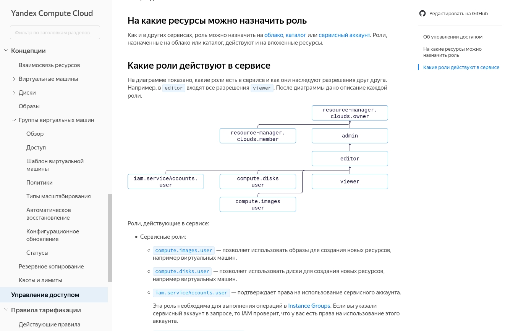

**english** | [русский](https://github.com/yandex-cloud/yfm-docs/blob/master/README.ru.md)
- - -

[](https://www.npmjs.org/package/@doc-tools/docs)

# yfm-docs

Yfm-docs lets you build a full-fledged documentation project: with navigation, internal transitions, and full
[Yandex Flavored Markdown (YFM)](https://www.npmjs.com/package/@doc-tools/transform) support. For example, [Yandex.Cloud documentation](https://cloud.yandex.ru/docs).



## Installation

```shell script
npm i @doc-tools/docs -g
```

## Usage

```shell script
yfm -i ./input-folder -o ./ouput-folder -v "{\"name\":\"Alice\"}"
```

## List of possible parameters

- `--input, -i`

    Path to the project directory (required parameter).

- `--output, -o`

    Path to the output directory (required parameter).

- `--allowHTML`

    Allow the use of HTML in MD files.

- `--varsPreset`

    Name of the used [preset](./DOCS.md#presets).

- `--vars, -v`

    Values of [YFM variables](https://github.com/yandex-cloud/yfm-transform/blob/master/DOCS.md#vars)

- `--strict, -s`

    Start in strict mode.

    YFM warnings are treated as errors. Disabled by default.

- `--quiet, -q`

    Start in quiet mode.

    Do not output logs to stdout. Disabled by default.

- `--config, -c`

    Path to the [YFM configuration file](./DOCS.md#config).

- `--output-format`

    Generation format: HTML or MD. By default, HTML.

- `--apply-presets`

    Shows whether to apply [presets](./DOCS.md#presets) when converting md2md.

- `--resolve-conditions`

    Shows whether to apply conditions when converting md2md.
    
- `--disable-liquid`
    
    Indicates whether to disable the use of the template engine

- `--ignore-stage`

    Ignore tocs with stage.

- `--publish`

    Should upload output files to S3 storage. Disabled by default.

- `--contributors`

    Should add contributors into files. Disabled by default.

- `--version`

    Current version.

- `--help`

    List of commands.

Learn more `yfm-docs --help`

[Learn more about the project structure](./DOCS.md)

## Build result

The built project is a set of static HTML pages that can be viewed locally, hosted on a hosting service,
on GitHub Pages, or in [S3](https://cloud.yandex.ru/services/storage):

```
output-folder
|-- index.html (Documentation leading page)
|-- quickstart.html (Document files and images)
|-- pages
    |-- faq.html
    |-- how-to.html
|-- assets
    |-- image1.png
    |-- image2.png
|-- includes
    |-- faq_shared_block.html
```

### Building a project in YFM

You can also build your project in YFM using the `--output-format=md` key.

In this case:

- Inserts in ToC files [are applied](./DOCS.md#tocIncludes).
- Conditions in the content and ToC files are calculated.
- Variables are applied if the `apply-presets` parameter is specified.
- All files specified in the ToC files, images used in them, and [insert files](https://github.com/yandex-cloud/yfm-transform/blob/master/DOCS.md#includes) will be copied.

Learn more about variables and conditions in [YFM documentation](https://github.com/yandex-cloud/yfm-transform/blob/master/DOCS.md#vars).

```
input-folder
|-- index.yaml (Documentation leading page)
|-- quickstart.md (Document files and images)
|-- pages
    |-- faq.md
    |-- how-to.md
|-- assets
    |-- image1.png
    |-- image2.png
|-- includes
    |-- faq_shared_block.md
```

## Source files

### Preparation

You need to add `.env` file into repo root with data below:

```bash
OWNER= 
REPO= # docs
TOKEN= # personal access token
BASE_URL= # for ex: https://api.github.com
TYPE= # github 
```

### Installation

```bash
cd yfm-docs
npm ci && npm run build
```

### Usage

```bash
npm run start -- -i ./input-folder -o ./ouput-folder -v "{\"name\":\"Alice\"}"
```

## License

MIT
