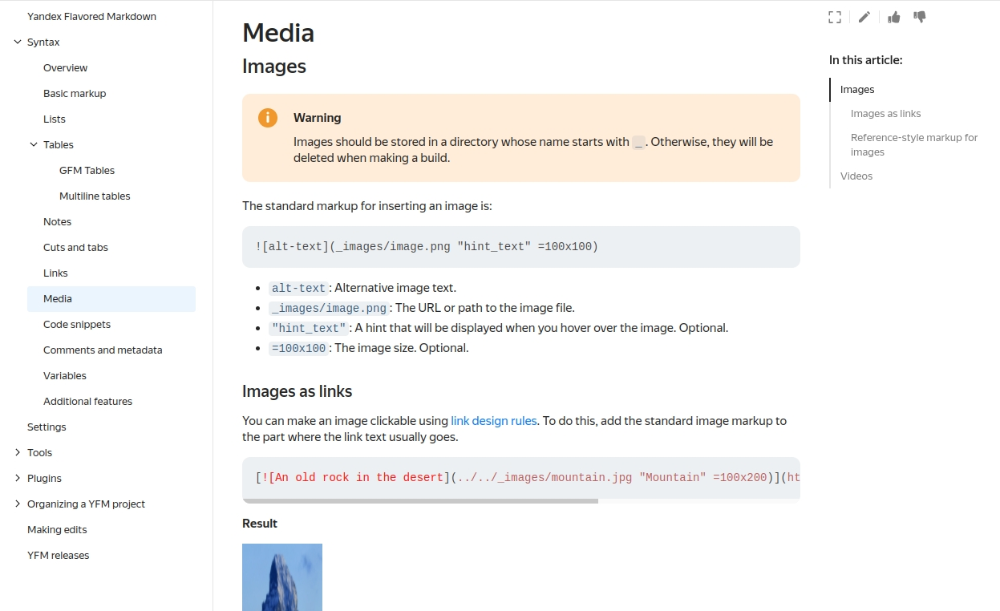

**english** | [русский](https://github.com/diplodoc-platform/cli/blob/master/README.ru.md)

---

[](https://www.npmjs.org/package/@diplodoc/cli)
[](https://sonarcloud.io/summary/new_code?id=diplodoc-platform_cli)
[](https://sonarcloud.io/summary/new_code?id=diplodoc-platform_cli)
[](https://sonarcloud.io/summary/new_code?id=diplodoc-platform_cli)
[](https://sonarcloud.io/summary/new_code?id=diplodoc-platform_cli)
[](https://sonarcloud.io/summary/new_code?id=diplodoc-platform_cli)

# yfm-docs

Yfm-docs lets you build a full-fledged documentation project: with navigation, internal transitions, and full
[Yandex Flavored Markdown (YFM)](https://diplodoc.com/docs/en/index-yfm) support.



## Documentation

[ydocs.tech](https://diplodoc.com/docs/en/tools/docs)

## Requirements

Node 22+

## Usage

```bash
npm i @diplodoc/cli -g
```

```bash
npm run start -- -i ./input-folder -o ./output-folder -v "{\"name\":\"Alice\"}"
```

## `yfm init`

Initialize a new Diplodoc documentation project.

### Usage

```bash
yfm init [options]
```

Running without flags in a terminal starts an interactive wizard. Pass `--skip-interactive` to use flags and defaults only.

### Options

| Option                    | Default            | Description                                       |
| ------------------------- | ------------------ | ------------------------------------------------- |
| `-o, --output <path>`     | `.`                | Directory to create the project in                |
| `--name <string>`         | directory basename | Project name                                      |
| `--langs <string>`        | `en`               | Comma-separated list of languages, e.g. `en,ru`   |
| `--default-lang <string>` | first of `--langs` | Default language                                  |
| `--template <string>`     | `minimal`          | `minimal` or `full`                               |
| `--header`                | `true`             | Add navigation header with controls to `toc.yaml` |
| `--force`                 | `false`            | Overwrite existing output directory               |
| `--dry-run`               | `false`            | Preview files without writing                     |
| `--skip-interactive`      | `false`            | Skip wizard                                       |

### Created files

**`minimal`**

```
<output>/
├── .yfm
├── toc.yaml
└── index.md
```

**`full`** — adds `presets.yaml`, `pc.yaml` and extended `.yfm` with pdf, search, vcs, authors config.

For multilingual projects (`--langs en,ru`) content is placed in per-language subdirectories:

```
<output>/
├── .yfm
├── presets.yaml
├── en/
│   ├── toc.yaml
│   └── index.md
└── ru/
    ├── toc.yaml
    └── index.md
```

## Source files

### Preparation

You need to add `.env` file into repo root with data below:

```bash
GITHUB_OWNER=
GITHUB_REPO= # docs
GITHUB_TOKEN= # personal access token
GITHUB_BASE_URL= # for ex: https://api.github.com
VCS_CONNECTOR_TYPE= # github
```

or you can update .yfm file into docs repo

```bash
connector:
    type:
    github:
        endpoint:
        token:
        owner:
        repo:
```

### Build from source

```bash
cd cli
npm ci && npm run build
```

## License

MIT
