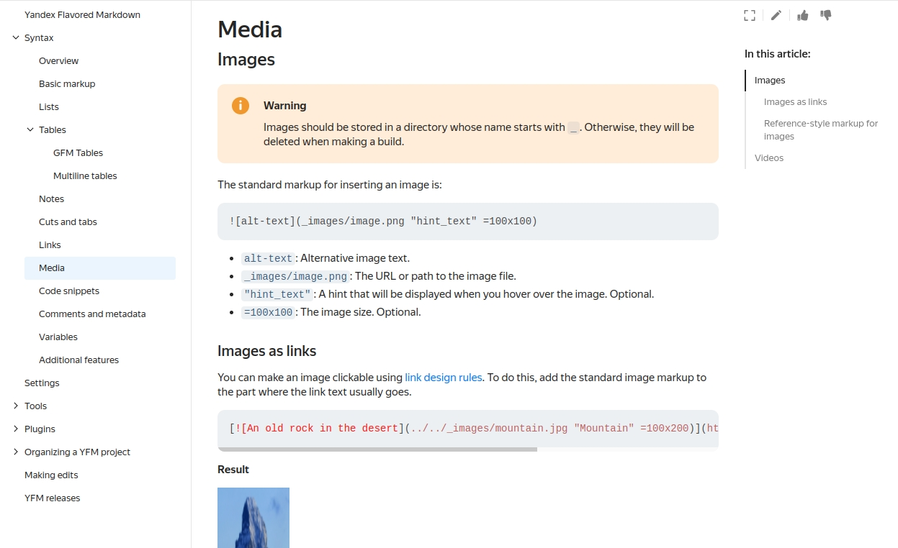

**русский** | [english](https://github.com/diplodoc-platform/cli/blob/master/README.md)
- - -

[](https://www.npmjs.org/package/@diplodoc/cli)

# yfm-docs

Yfm-docs позволяет собрать полноценный документационный проект: с навигацией, внутренними переходами и полной поддержкой
[Yandex Flavored Markdown (YFM)](https://diplodoc.com/docs/ru/index-yfm).



## Документация

[ydocs.tech](https://diplodoc.com/docs/ru/tools/docs)

## Требования

Node 22+

## Использование

```bash
npm i @diplodoc/cli -g
```

```bash
npm run start -- -i ./input-folder -o ./ouput-folder -v "{\"name\":\"Alice\"}"
```


## Исходники

### Подготовка

Необходимо добавить `.env` файл в рут репозитория с данными ниже:

```bash
GITHUB_OWNER=
GITHUB_REPO= # docs
GITHUB_TOKEN= # personal access token
GITHUB_BASE_URL= # for ex: https://api.github.com
VCS_CONNECTOR_TYPE= # github
```

или обновить .yfm файл в docs репозитории:

```bash
connector:
    type:
    github:
        endpoint:
        token:
        owner:
        repo:
```

### Сборка из исходников

```bash
cd cli
npm ci && npm run build
```

## License

MIT
