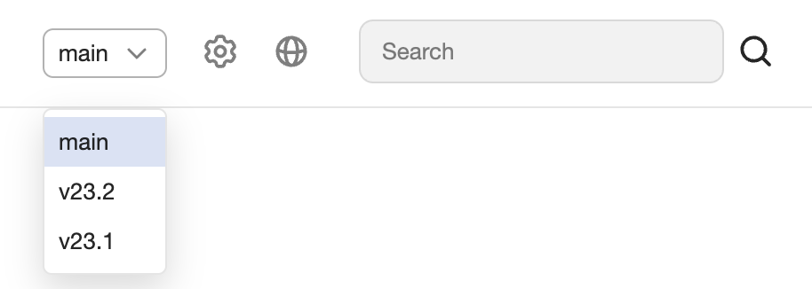

# Header

::: page-constructor
blocks:
  - type: 'basic-card'
    title: 'Заголовок 1'
    text: 'Текст 1 :::'
    border: 'shadow'
    controlPosition: 'content'
  - type: 'basic-card'
    title: 'Заголовок 2'
    text: ''
    border: 'shadow'
    controlPosition: 'content'
    icon: '_images/icons/bulb.svg'
:::
