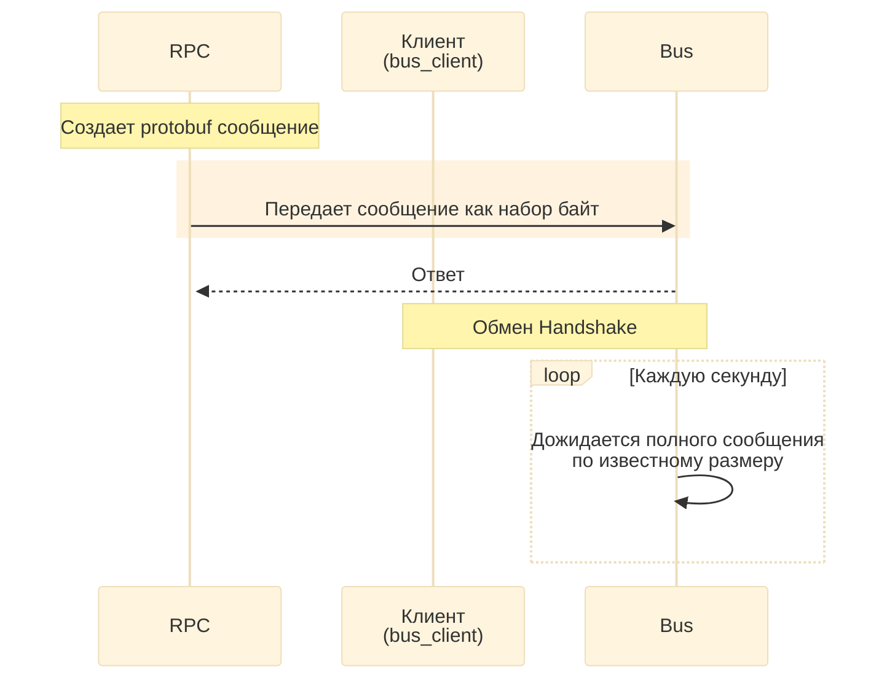
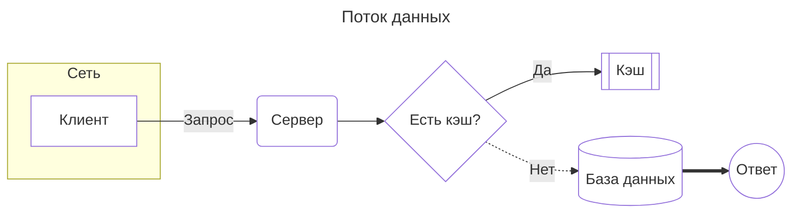
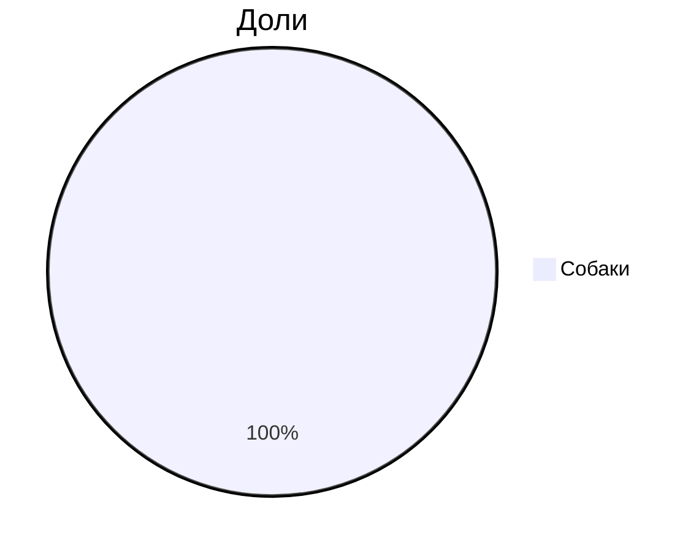

# Подписи в схемах mermaid

```mermaid
%%{init: {'theme':'base', 'themeVariables': { 'fontSize': '11px' }, 'sequence': { 'autonumber': false } }}%%
sequenceDiagram
    participant RPC as RPC
    participant C as Клиент<br/>(bus_client)
    participant Bus

    Note over RPC: Создает protobuf сообщение
    rect rgb(255, 243, 224)
    RPC->>Bus: Передает сообщение как набор байт
    end
    Bus-->>+RPC: Ответ
    Note over C,Bus: Обмен Handshake
    loop Каждую секунду
        Bus->>Bus: Дожидается полного сообщения<br/>по известному размеру
    end
```

```mermaid
---
title: Поток данных
---
flowchart LR
    %% комментарий схемы
    A[Клиент] -->|Запрос| B(Сервер)
    B --> C{Есть кэш?}
    C -- Да --> D[[Кэш]]
    C -. Нет .-> E[("База данных")]
    E ==> F((Ответ))
    subgraph net [Сеть]
        A
    end
    classDef default fill:#fff
```

```mermaid
pie
    title Доли
    "Собаки" : 386
```
