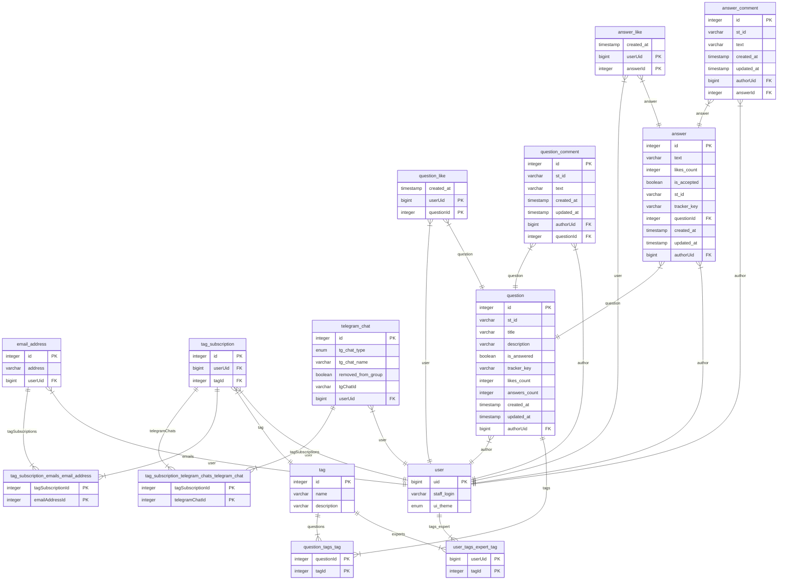

# Mermaid example

```mermaid
erDiagram
    email_address {
        integer id PK
        varchar address
        bigint userUid FK
    }
    tag_subscription {
        integer id PK
        bigint userUid FK
        integer tagId FK
    }
    telegram_chat {
        integer id PK
        enum tg_chat_type
        varchar tg_chat_name
        boolean removed_from_group
        varchar tgChatId
        bigint userUid FK
    }
    question_like {
        timestamp created_at
        bigint userUid PK
        integer questionId PK
    }
    question_comment {
        integer id PK
        varchar st_id
        varchar text
        timestamp created_at
        timestamp updated_at
        bigint authorUid FK
        integer questionId FK
    }
    answer_comment {
        integer id PK
        varchar st_id
        varchar text
        timestamp created_at
        timestamp updated_at
        bigint authorUid FK
        integer answerId FK
    }
    answer_like {
        timestamp created_at
        bigint userUid PK
        integer answerId PK
    }
    answer {
        integer id PK
        varchar text
        integer likes_count
        boolean is_accepted
        varchar st_id
        varchar tracker_key
        integer questionId FK
        timestamp created_at
        timestamp updated_at
        bigint authorUid FK
    }
    user {
        bigint uid PK
        varchar staff_login
        enum ui_theme
    }
    tag {
        integer id PK
        varchar name
        varchar description
    }
    question {
        integer id PK
        varchar st_id
        varchar title
        varchar description
        boolean is_answered
        varchar tracker_key
        integer likes_count
        integer answers_count
        timestamp created_at
        timestamp updated_at
        bigint authorUid FK
    }
    tag_subscription_emails_email_address {
        integer tagSubscriptionId PK
        integer emailAddressId PK
    }
    tag_subscription_telegram_chats_telegram_chat {
        integer tagSubscriptionId PK
        integer telegramChatId PK
    }
    user_tags_expert_tag {
        bigint userUid PK
        integer tagId PK
    }
    question_tags_tag {
        integer questionId PK
        integer tagId PK
    }
    email_address }|--|| user: user
    email_address ||--|{ tag_subscription_emails_email_address: tagSubscriptions
    tag_subscription }|--|| user: user
    tag_subscription }|--|| tag: tag
    tag_subscription ||--|{ tag_subscription_emails_email_address: emails
    tag_subscription ||--|{ tag_subscription_telegram_chats_telegram_chat: telegramChats
    telegram_chat }|--|| user: user
    telegram_chat ||--|{ tag_subscription_telegram_chats_telegram_chat: tagSubscriptions
    question_like }|--|| question: question
    question_like }|--|| user: user
    question_comment }|--|| user: author
    question_comment }|--|| question: question
    answer_comment }|--|| user: author
    answer_comment }|--|| answer: answer
    answer_like }|--|| answer: answer
    answer_like }|--|| user: user
    answer }|--|| user: author
    answer }|--|| question: question
    user ||--|{ user_tags_expert_tag: tags_expert
    tag ||--|{ user_tags_expert_tag: experts
    tag ||--|{ question_tags_tag: questions
    question ||--|{ question_tags_tag: tags
    question }|--|| user: author
```
